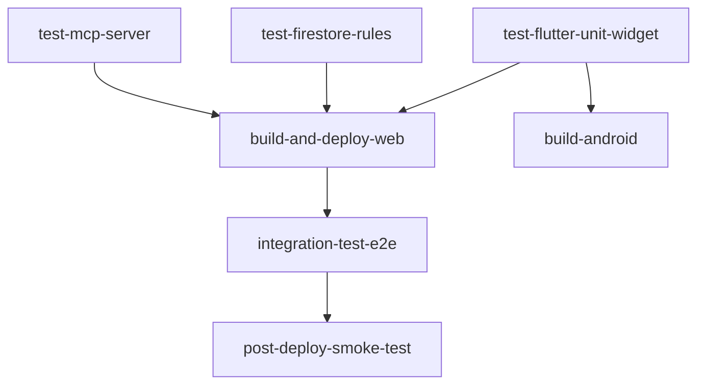

# Stratégie de Développement & Tests (TDD, Sécurité, CI/CD)

Ce document décrit les règles et instructions systèmes requises pour implémenter, maintenir et étendre la stratégie de test et de développement du projet *Very Simple Diary*.

---

## 1. Principes de Développement Dirigé par les Tests (TDD)

Toute nouvelle fonctionnalité, correction de bug ou règle métier doit être développée selon le cycle TDD strict :

1. **Phase Rouge (Red)** : Écrire un test unitaire affirmant le comportement attendu dans le dossier `test/`. Exécuter le test et vérifier qu'il échoue.
2. **Phase Verte (Green)** : Écrire l'implémentation minimale requise pour faire passer le test au vert.
3. **Refactorisation** : Nettoyer le code, restructurer les fonctions et éliminer la duplication sans briser les tests.

---

## 2. Types de Tests Obligatoires

### 2.1 Tests Unitaires & Limites (Flutter)
- Placer ces tests dans `test/`.
- **Cas Limites** : Tester systématiquement les bornes inférieures et supérieures (valeurs minimales `-2`, maximales `+2`).
- **Jeux de données volumineux** : Tester les performances de calcul avec des listes d'éléments de plus de 10 000 entrées pour valider la complexité algorithmique.
- **Robustesse** : Assurer la gestion gracieuse de valeurs incorrectes ou inattendues.

### 2.2 Tests des Règles de Sécurité (Firestore)
- Emplacement : `test/firestore_rules_test/`.
- Outil : `@firebase/rules-unit-testing`.
- **Règles à valider** :
  - Accès anonyme bloqué.
  - Lecture et écriture autorisées uniquement pour l'utilisateur sur son propre dossier (`/users/{userId}/...`).
  - Blocage strict des tentatives de lecture/écriture sur les collections d'autres utilisateurs.

### 2.3 Tests du Serveur MCP
- Emplacement : `mcp_server/test/`.
- Outils : `mocha`, Node native test runner.
- **Règles à valider** :
  - Formatage Markdown correct de la ressource `diary://daily/{date}`.
  - Résolution et pertinence des résultats de l'outil `get_diary_insights`.

### 2.4 Tests d'Intégration / E2E (IHM)
- Emplacement : `integration_test/`.
- Outil : `integration_test` (Flutter).
- Scénario complet simulé (login -> sélection des 24 questions -> validation -> page récapitulative).

---

## 3. Structure des Workflows CI/CD (GitHub Actions)

Pour garantir une validation à chaque étape du build et du déploiement, les workflows doivent être séparés en jobs dépendants :

### Description des Jobs CI/CD :
1. **`test-mcp-server`** : Compilation TypeScript et exécution des tests unitaires du serveur MCP.
2. **`test-firestore-rules`** : Lancement du simulateur Firebase et validation des règles de sécurité Firestore.
3. **`test-flutter-unit-widget`** : Analyse de code (`flutter analyze`) et exécution des tests unitaires/widgets Flutter.
4. **`build-and-deploy-web`** : S'exécute après la réussite des jobs de test 1, 2 et 3. Compile la version Web et la déploie sur Firebase Hosting.
5. **`build-android`** : S'exécute après la réussite du job 3. Compile l'APK release de manière indépendante.
6. **`integration-test-e2e`** : S'exécute après le déploiement Web. Lance les tests d'intégration Flutter en mode headless Chrome.
7. **`post-deploy-smoke-test`** : Exécute un ping/curl sur les URL déployées pour s'assurer que le service répond correctement (statut `200 OK`).
