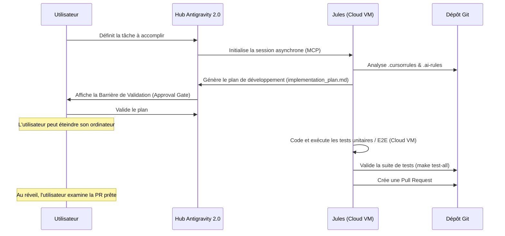

# Guide de Vibe Coding Asynchrone (Antigravity 2.0 + Jules MCP)

Ce document décrit le fonctionnement et la configuration de la branche `vibecoding-async` de **Very Simple Diary**, spécialement conçue pour le développement asynchrone guidé par l'IA.

---

## 1. L'Architecture de Vibe Coding Asynchrone

Le couplage le plus puissant consiste à utiliser l'application centrale **Antigravity 2.0** (le hub d'agents) connecté à **Jules** via le protocole **MCP (Model Context Protocol)**.

### Flux de Travail (Workflow)

---

## 2. Le Cadre Rigoureux ("Context-as-Code")

Pour s'assurer que l'agent asynchrone ne dérive pas, le dépôt embarque les fichiers `.cursorrules` et `.ai-rules` contenant les contraintes strictes du projet :
*   **Architecture Riverpod v2** : Utilisation exclusive du générateur de code (`@riverpod`).
*   **Structure Feature-first** : Découpage par dossier de fonctionnalité (`lib/features/`).
*   **Drift Database** : Persistance locale via sqlite typé et optimisé.
*   **Firestore Security Rules** : Règles de sécurité restrictives interdisant les accès croisés ou anonymes.
*   **Design Aesthetics Premium** : Mode sombre soigné, palettes HSL, animations, aucune police système par défaut (préférer Inter/Roboto/Outfit).

---

## 3. La Boucle de Validation de Tests

L'agent doit obligatoirement valider l'ensemble des suites de tests avant de soumettre son travail :
*   **Sur Linux/macOS/WSL/Git Bash** : `make test-all`
*   **Sur Windows PowerShell** : `.\run_tests.ps1 test-all`

Ces commandes lancent de manière ordonnée :
1.  **Tests unitaires & Widget Flutter** (cas limites bornes -2/+2 et volumétrie >10k éléments).
2.  **Tests des règles Firestore** (lance l'émulateur Firestore et teste les blocages d'accès).
3.  **Tests du serveur MCP** (compilation TypeScript et tests de schémas de ressources).
4.  **Tests d'intégration E2E Flutter** (le parcours utilisateur complet de 24 questions).

---

## 4. Les Agents Spécialisés Quotidiens

Afin de maintenir une qualité de code irréprochable au fil du temps, deux agents automatisés effectuent des analyses de fond chaque nuit :

### 🛡️ Sentinel (Agent de Sécurité)
*   **Rôle** : Scanner quotidiennement le dépôt pour identifier les failles de sécurité, fuites de secrets ou régressions des règles d'accès Firestore.
*   **Action** : Soumet des correctifs automatiques via des Pull Requests de sécurité à votre réveil.

### ⚡ Bolt (Agent de Performance)
*   **Rôle** : Auditer les performances mémoire et processeur de l'application (analyse des streams Drift non fermés, fuites de contextes Riverpod, et optimisations de requêtes).
*   **Action** : Propose des optimisations pour conserver la fluidité de l'application même sur les appareils anciens.
