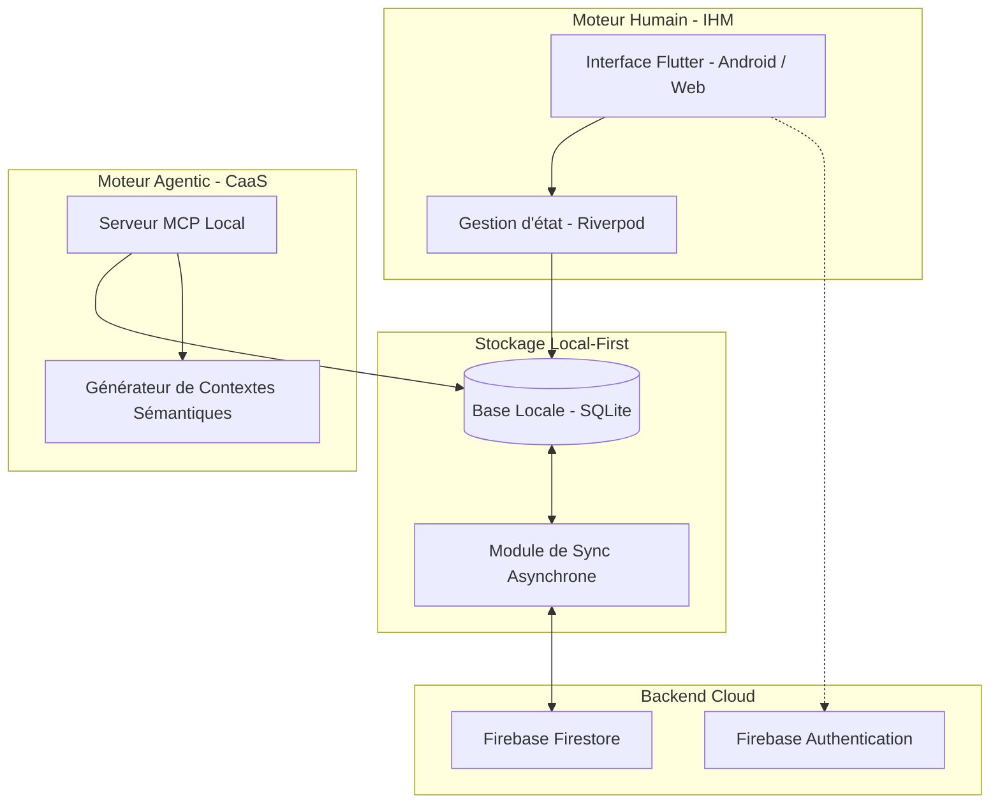

# Spécifications Fonctionnelles & Techniques
## Projet : Very Simple Diary

Ce document présente l'architecture, les spécifications fonctionnelles et techniques, ainsi que le plan d'implémentation de l'application **Very Simple Diary**.

L'application repose sur un paradigme de conception **Dual-Engine** :
1. **Moteur Humain (IHM)** : Une interface Flutter épurée, performante et axée sur une saisie rapide pour l'utilisateur.
2. **Moteur Agentic (CaaS - Context as a Service)** : Un serveur MCP (Model Context Protocol) permettant aux agents IA d'accéder au contexte sémantique de l'utilisateur de manière sécurisée et locale.

---

## 1. Architecture Dual-Engine

L'architecture est pensée pour séparer la logique de présentation humaine de l'accès sémantique pour les agents d'intelligence artificielle, tout en maintenant une source de vérité unique et locale (Local-First).



### 1.1 Moteur Humain (IHM Flutter)
* **Framework** : Flutter (Web & Android en cibles prioritaires, architecture extensible vers iOS, SmartWatch, et SmartTV).
* **Gestion d'État** : Riverpod (approche *Feature-first*).
* **Design** : Interface minimaliste, sans distraction, axée sur la vitesse de saisie. Temps de réponse local quasi-instantané (< 50ms pour les transitions).

### 1.2 Moteur Agentic (CaaS via MCP)
* **Protocole** : Model Context Protocol (MCP) développé par Anthropic.
* **Rôle** : Exposer des outils, des ressources et des invites (prompts) standardisés pour permettre à un agent IA (ex. Claude Desktop, Copilot, Apple Intelligence) d'interagir avec le journal de l'utilisateur.
* **Fonctionnement Local** : Le serveur MCP s'exécute localement et interroge directement la base de données SQLite locale de l'application. Aucune donnée brute n'est envoyée dans le cloud à des fins de traitement IA sans le consentement explicite de l'utilisateur.

### 1.3 Gestion des Données (Local-First / Cloud Sync)
* **Stockage Local** : SQLite (via Drift dans Flutter et `sqlite3` dans Node.js), permettant le partage direct et simultané du fichier de base de données local entre l'IHM Flutter et le serveur MCP sans duplication ni conversion.
* **Synchronisation Cloud** : Synchronisation asynchrone avec Firebase Firestore. En cas d'absence de connexion Internet, l'application reste 100 % opérationnelle localement. La synchronisation se déclenche en arrière-plan dès le retour du réseau.
* **Authentification** : Firebase Auth (Google Sign-In + Email/Mot de passe).

---

## 2. Écrans du MVP (IHM Humaine)

### 2.1 Écran unique de connexion (Authentification)
* **Règles d'ergonomie** : Écran épuré avec fond sombre dégradé, logo minimaliste au centre.
* **Composants exclusifs** :
  1. Bouton proéminent "Se connecter avec Google".
  2. Formulaire traditionnel : Champs "Email", "Mot de passe" et bouton "Valider".
* **Rôle technique** : Créer/récupérer le profil utilisateur, télécharger l'historique depuis Firestore en arrière-plan et initialiser la base locale.

### 2.2 Écran de Saisie des Questions (24 étapes successives)
L'application utilise un gabarit unique pour guider l'utilisateur à travers 24 questions thématiques.

```
+-------------------------------------------------------------+
| [ Thème : 1. Santé, Sport & Sommeil ]  [ Question 1 / 24 ]  |
|                                                             |
|                      >> SOMMEIL <<                          |
|         Qualité de la nuit, endormissement, récup...        |
|                                                             |
|  [||||||||||||||                     ] (Barre de prog. 4.1%)|
+-------------------------------------------------------------+
|  PERIODE      NEGATIF   NUL    MOYEN    BON    OPTIMAL      |
|  Nuit          [ ]      [ ]     [ ]     [ ]      [ ]        |
|  Matin         [ ]      [ ]     [ ]     [ ]      [ ]        |
|  Journée       [ ]      [ ]     [ ]     [ ]      [ ]        |
|  Soir          [ ]      [ ]     [ ]     [ ]      [ ]        |
+-------------------------------------------------------------+
|                                             [ SUIVANT > ]   |
+-------------------------------------------------------------+
```

* **Structure de la Grille Temporelle** :
  * **Périodes** : Nuit (00h-05h), Matin (05h-11h), Journée (11h-17h), Soir (17h-00h).
  * **Options** : Négatif (-2), Nul (-1), Moyen (0), Bon (+1), Optimal (+2).
  * **Règle de Sélection** : Choix multiple libre. L'utilisateur peut cocher entre 0 et 5 cases par ligne (ex. s'il a ressenti à la fois une grande fatigue ("Négatif") et un moment de sursaut d'énergie ("Optimal") pendant la journée).
  * **Commentaires par Période** : En tapant sur le nom d'une période (ex. "Nuit (00h-05h)", "Matin (05h-11h)", etc.), une boîte de dialogue s'ouvre permettant à l'utilisateur de saisir un commentaire textuel libre (limité à 64 caractères) pour apporter du contexte sémantique (ex. "Sommeil agité", "Séance de fractionné intense").
* **Navigation** : Le bouton "Suivant" valide, enregistre l'état actuel en brouillon local, et passe à la question suivante avec une micro-animation fluide de transition latérale.

### 2.3 Écran Récapitulatif Final
Affiché automatiquement après la validation de la 24ème question.

* **Bloc Synthèse** : Affichage sous forme de grille de 6 cartes de score (une par thème majeur), affichant la tendance visuelle (couleur et icône) de la journée.
* **Bloc Score Global** :
  * **Total** : Somme de toutes les valeurs cochées.
  * **Moyenne** : Moyenne arithmétique des valeurs cochées.
  * **Médiane** : Valeur médiane de la série de valeurs cochées.
  * **Niveau** : Affichage textuel basé sur la moyenne globale :
    * $\ge 1.5$ : *Optimal* 🟢
    * $[0.5, 1.5[$ : *Bon* 🟢
    * $[-0.5, 0.5[$ : *Moyen* 🟡
    * $[-1.5, -0.5[$ : *Nul* 🟠
    * $< -1.5$ : *Négatif* 🔴
  * **Texte explicatif** : Un court paragraphe généré automatiquement analysant les points forts et faibles de la journée.
* **Bouton "Valider la journée"** : Fige les données pour cette journée (interdiction de modification ultérieure sans déverrouillage explicite) et ferme la session quotidienne.

### 2.4 Gestion des Dates et Périodicité
* **Fenêtre temporelle d'enregistrement** : Par défaut, la saisie quotidienne enregistre les ressentis sur la période allant de **22h00 la veille** à **00h00 (minuit) le jour même** (couvrant ainsi la nuit complète précédente).
* **Persistance continue (Brouillon)** : Chaque pression sur "Suivant" écrit immédiatement en base locale. Si l'application est tuée, elle se rouvre sur la question en cours.

### 2.5 Écran d'Exploration des Données (Dashboard)
Cet écran offre une vue d'ensemble et permet d'analyser l'historique des données récoltées.

* **Statistiques Globales** : Résumé en tête d'écran indiquant le nombre total de jours suivis et le score moyen sur les jours finalisés.
* **Filtres d'Affichage** :
  * Filtre par statut : Tout, Brouillons, Finalisés.
  * Filtre par niveau : Tout, Optimal, Bon, Moyen, Nul, Négatif.
* **Évolution sur Période** :
  * Sélection d'une plage de dates (De / À) via un calendrier.
  * Sélection du type de calcul (Moyenne ou Médiane) pour afficher les tendances sous forme de carrousel horizontal pour les 24 questions thématiques.
* **Aperçu des Choix de la Journée Sélectionnée** :
  * Affiche en détail les réponses et commentaires saisis pour la journée sélectionnée dans la liste.
  * **Bouton Modifier (Crayon)** : Permet de modifier la journée. Après confirmation par boîte de dialogue, la journée repasse en statut `"draft"` et l'utilisateur est redirigé vers le questionnaire pour modifier ses réponses.
  * **Bouton Supprimer (Poubelle rouge)** : Supprime définitivement la journée. Après confirmation par boîte de dialogue, les données sont effacées localement et sur le cloud (Firestore). La sélection bascule automatiquement sur la journée suivante.
* **Liste des Journaux Enregistrés** : Liste chronologique affichant la date, le statut (Brouillon/Finalisé), le score, le niveau et le texte explicatif d'insight. Un tap sur une ligne met en valeur cette journée pour en afficher l'aperçu. Un clic sur l'icône de flèche ouvre le questionnaire (si brouillon) ou le récapitulatif final (si finalisé).

---

## 3. Spécifications CaaS (Moteur Agentic)

Le serveur MCP local expose l'état de l'utilisateur aux agents IA via les primitives standardisées du Model Context Protocol.

### 3.1 Ressources (Resources)
Les ressources exposent les données sous forme de documents textuels/markdown structurés.

| URI de la Ressource | Description | Format de Sortie |
| :--- | :--- | :--- |
| `diary://daily/{date}` | Contenu complet de la journée spécifiée (choix, scores, niveau, texte explicatif). | Markdown |
| `diary://themes/trends?days={N}` | Historique des scores moyens par thème sur les $N$ derniers jours. | JSON / Markdown |
| `diary://schema/questions` | Liste ordonnée des 24 questions avec leurs identifiants et thèmes associés. | JSON |

### 3.2 Outils (Tools)
Les outils permettent aux agents d'effectuer des calculs, de rechercher des motifs ou de modifier l'état (avec approbation).

* **`get_diary_insights`** :
  * **Paramètres** : `startDate` (string, ISO), `endDate` (string, ISO).
  * **Description** : Retourne une analyse statistique détaillée (corrélations entre sommeil et humeur, impacts de l'alimentation sur la douleur, etc.).
* **`save_draft_response`** :
  * **Paramètres** : `date` (string), `questionId` (int), `period` (enum), `ratings` (array of ints).
  * **Description** : Permet à l'IA d'assister la saisie du journal via une conversation vocale ou textuelle.
* **`finalize_diary_day`** :
  * **Paramètres** : `date` (string).
  * **Description** : Valide et fige définitivement la journée sélectionnée.

### 3.3 Invites de Base (Prompts)
Le serveur MCP expose des configurations de prompts prédéfinies :

* **`AnalyzeMyDay`** : Configure l'IA pour analyser la ressource `diary://daily/today` et donner des conseils personnalisés de biohacking ou de bien-être.
* **`CorrelationsFinder`** : Invite l'IA à croiser les thèmes pour identifier les causes racines des baisses d'énergie ou de moral.

---

## 4. Modèle de Données Cible

### 4.1 Schéma Base de Données Locale (Local-First)
Le modèle est conçu pour être plat et rapide à requêter, particulièrement pour les agrégations de séries temporelles demandées par le CaaS.

#### Table : `diary_days`
* `id` : UUID (Primary Key)
* `date` : Date (YYYY-MM-DD, Unique index)
* `status` : Enum (`draft`, `finalized`)
* `total_score` : Float
* `mean_score` : Float
* `median_score` : Float
* `level` : String
* `insight_text` : Text (Nullable)
* `created_at` : Timestamp
* `updated_at` : Timestamp
* `synced_at` : Timestamp (Nullable)

#### Table : `responses`
* `id` : UUID (Primary Key)
* `diary_day_id` : UUID (Foreign Key -> `diary_days.id` ON DELETE CASCADE)
* `question_number` : Integer (1 à 24, Index)
* `nuit_values` : SmallInt (Bitmask ou liste de scores sélectionnés : ex : [-2, 0])
* `matin_values` : SmallInt
* `journee_values` : SmallInt
* `soir_values` : SmallInt
* `nuit_comment` : Text (Commentaire sémantique de la nuit, limité à 64 caractères)
* `matin_comment` : Text (Commentaire sémantique du matin, limité à 64 caractères)
* `journee_comment` : Text (Commentaire sémantique de la journée, limité à 64 caractères)
* `soir_comment` : Text (Commentaire sémantique du soir, limité à 64 caractères)
* `updated_at` : Timestamp

> [!NOTE]
> Pour stocker les sélections multiples de valeurs (-2, -1, 0, 1, 2) par période, nous pouvons utiliser un format JSON simple dans la base locale (`[-2, 1]`) ou un champ entier de type Bitmask pour optimiser les performances d'indexation.

### 4.2 Mapping Firebase Firestore
Chaque journée de journalisation est représentée par un document Firestore unique sous le chemin :
`/users/{userId}/diary_days/{date}`

Le document embarque la totalité de la structure pour éviter les jointures coûteuses sur Firestore (modèle dénormalisé) :

```json
{
  "date": "2026-06-12",
  "status": "finalized",
  "scores": {
    "total": 12,
    "mean": 0.45,
    "median": 1.0,
    "level": "Bon"
  },
  "insight_text": "Excellente journée marquée par une bonne hydratation...",
  "responses": {
    "q01_sommeil": {
      "nuit": [-1, 0],
      "nuit_comment": "Sommeil agité",
      "matin": [1],
      "matin_comment": "",
      "journee": [2],
      "journee_comment": "",
      "soir": [1, 2],
      "soir_comment": ""
    },
    "q02_sport": {
      "nuit": [],
      "nuit_comment": "",
      "matin": [0],
      "matin_comment": "Petite séance d'étirements",
      "journee": [1],
      "journee_comment": "",
      "soir": [-2],
      "soir_comment": "Douleur genou"
    }
  },
  "created_at": "2026-06-12T07:15:00Z",
  "updated_at": "2026-06-12T22:05:00Z"
}
```

---

## 5. Intégrations GCP & Cloud Functions

### 5.1 Cloud Function : `onDiaryDayFinalized`
* **Déclencheur** : Écriture Firestore sur `/users/{userId}/diary_days/{date}` avec `status == "finalized"`.
* **Traitements** :
  1. Validation de la structure des données (intégrité des scores).
  2. Calcul d'insights avancés via l'API Vertex AI (si option activée par l'utilisateur).
  3. Mise à jour de statistiques agrégées hebdomadaires/mensuelles dans le document utilisateur pour un accès rapide.

### 5.2 Cloud Function : `healthcheck`
* **Rôle** : Endpoint HTTPS public retournant l'état opérationnel des dépendances (Firestore, Vertex AI, quota d'API).
* **Sécurité** : Protégé par une clé d'API ou jeton d'accès réservé à l'application et au monitoring DevOps.

---

## 6. Plan de Test Détaillé (Pyramide des Tests Élargie)

```
        / \
       /   \      Healthchecks (Disponibilité Cloud & API)
      /     \     Système / UI (Cinématique 24 questions, validation)
     /-------\    MCP Contrats (Schémas sémantiques, outils & ressources)
    /         \   Intégration (Moteur SQLite local <-> Firestore Sync)
   /-----------\  Unitaires (Riverpod providers, math des scores, médiane)
  /_____________\
```

### 6.1 Tests Unitaires (Flutter)
* **Périmètre** : Validations mathématiques de la moyenne, médiane et score total d'un ensemble de réponses.
* **Outil** : `flutter_test`.
* **Cas critiques** : Cas de listes vides, gestion des valeurs négatives, calcul correct de la médiane sur un nombre pair/impair de valeurs sélectionnées.

### 6.2 Tests d'Intégration & Sync (Flutter)
* **Périmètre** : Écritures SQLite locales (via Drift) et mécanismes de synchronisation asynchrone avec Firestore (simulation de pertes réseau).
* **Outil** : `integration_test` avec base SQLite en mémoire et mock de Firestore.

### 6.3 Tests de Contrat MCP (TypeScript/Node.js)
* **Périmètre** : S'assurer que le serveur MCP répond exactement selon les schémas JSON Schema définis, et que la transformation des données locales en markdown sémantique ne subit pas de régression.
* **Outil** : Mocha/Jest + suite de validation MCP SDK.

### 6.4 Tests UI & Accessibilité (Flutter)
* **Périmètre** : Cinématique de passage des 24 questions. Vérification des ratios de contraste sur le thème sombre, et support de la navigation par touches/D-pad pour les futures versions TV/Smartwatch.
* **Outil** : `flutter_driver` / `golden_tests`.

---

## 7. Roadmap & DevOps

### 7.1 Pipeline CI/CD GitHub Actions (`.github/workflows/ci_cd.yml`)
Le pipeline exécute automatiquement les étapes suivantes à chaque push ou pull request sur la branche `main` :

1. **Analyse de Code** : Validation du formatage (`dart format`) et exécution du linter (`flutter analyze`).
2. **Tests Automatisés** : Exécution des tests unitaires Flutter et des tests de contrats MCP.
3. **Build Android** : Génération de l'APK Release non signé (puis signé via des secrets GitHub).
4. **Build Web** : Compilation de l'application Web.
5. **Déploiement Continu** : Déploiement automatique de la version Web sur Firebase Hosting.

---

## 8. Guide de Configuration Initial (Local-First Development)

Le développement local utilise Docker pour isoler l'écosystème cloud.

### 8.1 Configuration de Firebase Emulator Suite via Docker
Créer un fichier `docker-compose.yml` à la racine pour lancer les émulateurs Firebase localement sans toucher à la production GCP.

```yaml
version: '3.8'
services:
  firebase-emulators:
    image: andreysenov/firebase-tools:latest
    ports:
      - "4000:4000" # Emulator Suite UI
      - "8080:8080" # Firestore Emulator
      - "9099:9099" # Auth Emulator
    volumes:
      - .:/home/node/app
    working_dir: /home/node/app
    command: firebase emulators:start --project very-simple-diary-dev
```

### 8.2 Lancement du Serveur MCP Local
Le serveur MCP local est développé en Node.js/TypeScript et communique avec le fichier de base de données SQLite généré par l'application Flutter.

```bash
cd mcp_server
npm install
npm run build
# Enregistrement dans Claude Desktop (config.json)
# {
#   "mcpServers": {
#     "very-simple-diary-mcp": {
#       "command": "node",
#       "args": ["d:/development/VerySimpleDiary/mcp_server/build/index.js", "d:/development/VerySimpleDiary/db/diary.db"]
#     }
#   }
# }
```

---

## 9. PROMPT D'AMORÇAGE POUR ANTIGRAVITY

> [!IMPORTANT]
> Copiez et collez le prompt ci-dessous dans Antigravity pour démarrer automatiquement le projet de vibe coding avec configuration DevOps et Local-First.

```text
PROMPT D'AMORÇAGE : DÉMARRAGE DU PROJET "VERY SIMPLE DIARY"

Agis en tant qu'Ingénieur DevOps et Développeur Principal Flutter/MCP. Ton objectif est d'initialiser l'écosystème complet du projet "Very Simple Diary" dans le dossier actuel.

Suis rigoureusement les étapes suivantes de manière automatisée (YOLO mode actif) :

1. INITIALISATION GIT & GITHUB
   - Initialise un dépôt Git local si ce n'est pas déjà fait.
   - Crée le dépôt GitHub distant "stanworld80/VerySimpleDiary" en utilisant les outils MCP GitHub (si possible, sinon prépare les commandes de push).
   - Configure le remote git.

2. STRUCTURE FLUTTER (Riverpod + Feature-First)
   - Crée l'application Flutter avec le package ID : "fr.stanislasselleinformatique.verysimplediary".
   - Ajoute dans pubspec.yaml les dépendances essentielles :
     - flutter_riverpod, riverpod_annotation, drift, sqlite3, sqlite3_flutter_libs, path_provider, firebase_core, firebase_auth, cloud_firestore.
   - Structure le dossier `lib` selon le pattern Feature-First :
     - /lib/features/auth/ (UI, controller, repository)
     - /lib/features/diary/ (UI pour la saisie 24 questions, récapitulatif, logique de score)
     - /lib/core/ (thème, base de données locale Drift/SQLite, configurations réseau)
   - Génère un squelette fonctionnel pour le calcul du score (Total, Moyenne, Médiane) et écris un test unitaire validant cette logique dans /test.

3. CONFIGURATION LOCAL-FIRST (Firebase Emulators via Docker)
   - Génère les fichiers firebase.json et database rules requis pour les émulateurs Firebase.
   - Crée le fichier docker-compose.yml décrit dans les spécifications techniques pour lancer Firestore et Auth en local.
   - Écris un script shell ou powershell court pour démarrer le docker-compose et lancer les émulateurs.

4. STRUCTURE DU SERVEUR MCP LOCAL
   - Crée un dossier `/mcp_server` contenant un projet Node.js TypeScript.
   - Installe `@modelcontextprotocol/sdk` et configure un serveur MCP de base.
   - Implémente le squelette de la ressource "diary://daily/{date}" et de l'outil "get_diary_insights" pour qu'ils lisent un fichier SQLite/JSON de test.

Reste pragmatique, écris du code robuste, et execute les scripts d'initialisation. Une fois terminé, présente un compte-rendu des fichiers générés et des tests exécutés avec succès.
```

---

## 10. CONFIGURATION & DÉPLOIEMENT DE PRODUCTION

### 10.1 Initialisation de Firestore
Le déploiement Firebase nécessite que Cloud Firestore soit activé en mode Natif sur le projet GCP. Les bases de données par défaut ont été créées avec les paramètres suivants :
- **Mode de base de données** : Firestore Native (`type=firestore-native`)
- **Région** : `europe-west9` (Paris, France)

Ces configurations s'appliquent aux environnements de Développement (`stanverysimplediary-dev`) et de Staging (`stanverysimplediary-stg`).

